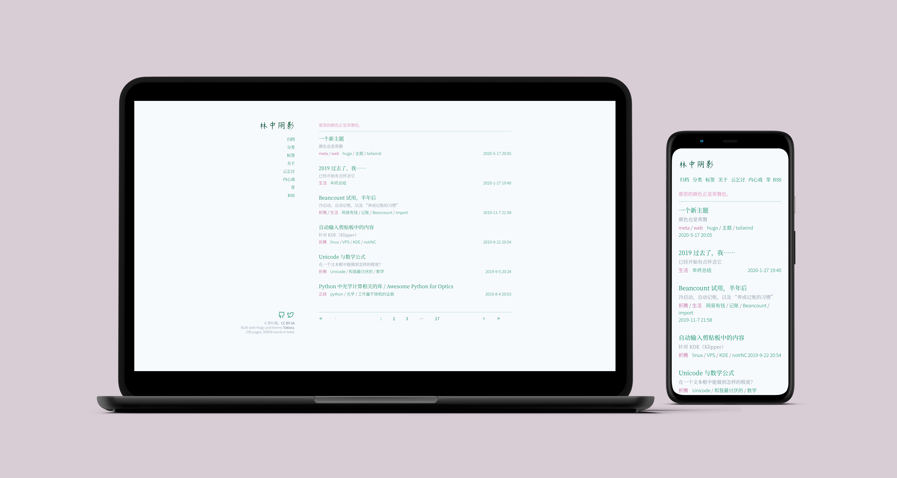

项目地址：<https://github.com/heyeshuang/hugo-theme-tokiwa>

大概是3月末，我在例行的`检查博客有没有自己偷偷更新`的活动中，开始对这个网页感到厌烦了。同时，我在一个月的高强度~~打牌~~[狩猎](https://store.steampowered.com/app/582010/MONSTER_HUNTER_WORLD/)之后，自我厌恶感达到了又一个峰值。又到了做些什么的时间了。

中间的事情，比如说连续加班21天啊，往肋间插了根管子啊，暂且按下不表。作为结果，我的博客变成了现在的样子。

{}





{}

新主题继承了之前的配色，也以配色而命名。记得[当时]()我选了主题`blackburn`，又觉得默认的蓝色有些“默认”，于是自己挑了一种，恰好是现在所说的常磐色。嗯，看起来绿油油的。

其他的方面，用了现在流行的、尽情浪费显示器空间的布局，还用了尽情浪费网路流量的网页字体。用2M流量换一个帅气的标题，feels good man[^1].

另外，现在正在试图向[gohugoio/hugoThemes](https://github.com/gohugoio/hugoThemes/issues/850)投稿，当前（2020-5-19）的进度是在与老外激情对线。都2020年了，我居然因为开源许可证气得睡不着觉，感觉自己的青春又回来了。

我没什么好交代的了。下次见。

---
> 来自2020-6-1的更新：

我突然发现自己连项目的主页都没有写……放在前面了。

另外，如果要剪裁字体，而且安装了`node.js`的话，可以使用下面的命令：

```bash
npx fontmin 字体名称.ttf -t "要用到的字形" > 字体名称-剪裁后.ttf 
```

因为我一直没有一台特别可靠的服务器，正文用的字体就不自动剪裁了。也算是给5G一个应用场景吧？虽然还没有用上。

--- 

> 来自2020-6-12的更新：

终于通过了Hugo Themes的投稿：<https://themes.gohugo.io/hugo-theme-tokiwa/>

That's a long trip.

---

> 来自2020-6-14的更新：

从[专业人士](https://blog.shuiba.co/lots-stuff-of-new-theme)那里学到了头图的做法。

[^1]:说笑的，待会我就会把字体裁好。