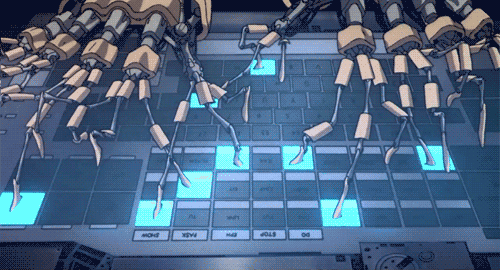
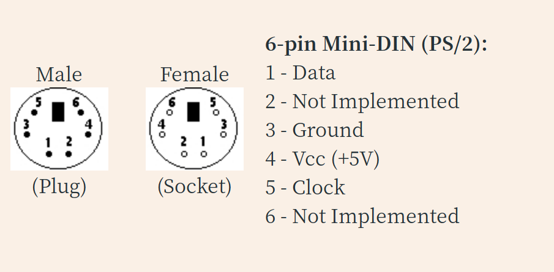

> 有时候你会[^1]遇到一些电脑，孤零零的漂浮在互联网络之外，所有USB口都上了锁，要送进去一些文件，必须要找海关盖上十几个章才能够放行。

> 当然，显示器、鼠标和键盘还是可以用的，可以让上个世纪的打字小妹一点一点地敲击按键……或者在敲的同时走神，想一想有没有什么别的办法。

> 下面就是某一天下午，被锁链铐在工位上的我的白日梦。

好吧，现在的情况还不算太糟，至少还有输入设备（键盘，或者像是键盘的什么玩意儿），实在不行的话，我们也可以做出一个 **超级打字机器人3000** 之类的。

*想着这些，我把键盘上的导线扯了下来，我看见线的另一头连着的接口是——*

### a. 扁扁的长方形，里面只有四片铜片和一片塑料：

这么说他们也并没有把USB口完全封死嘛。

*我想起还没有被奴役的时候，在网上自由自在地冲浪的时候，曾经看到过一种叫做badUSB的东西。* 

我记得[那玩意](https://github.com/SpacehuhnTech/WiFiDuck)就可以模拟USB键盘，没准正是我想要的。

*我仔细阅读了README，但变得有些失望。*

不，这个不行。每个键盘都有独一无二的UID和HID识别码，如果不能模拟这些号码，我会被守卫发现的。没准神秘的TB黑客能帮得上忙。

*躲开守卫的视线，我开始翻阅黑客目录，接着，我发现了一块代号为[CH3929](https://item.taobao.com/item.htm?spm=a1z09.2.0.0.10462e8dAwSoVQ&id=607040512173&_u=i26o2jl627c)的芯片。*

这个应该可以，可能是设计给物理外挂用的，用上这个，我就可以用串口控制芯片，再用芯片模拟键盘，嗯，十分直接。

什么？直接用串口通信？不不不这太危险了。*上工的铃声把我惊醒，我揉揉眼睛，发现手里的键盘接口变了形状——*

### b. 圆形，里面有6根金属圆柱和一块塑料块：

居然PS/2这种接口还没有绝迹，真不愧是尊重传统的企业啊。我听说这种接口的协议就更简单了，完全没有识别环节，对电脑来说，所有键盘都是一样的，而且也有外面的好心人做了[两种](https://github.com/emard/esp32ps2)[程序](https://github.com/Harvie/ps2dev)，只要烧进ESP32，就能够模拟PS/2键盘。

而且信息输出也不是不可能的，除了老土的屏幕照相之外，还能用[视频二维码](https://divan.dev/posts/fountaincodes/)，看起来既迅速又高大上——

“小X，来新活了！”

“这就来！”

等我敲完这一批字之后，一定要去试一试。*我这样想。*

> 免责声明：上面的只是白日梦而已，完全没有测试过。请遵守本地法律法规和公司规章制度，不管你干了什么都跟我没有任何关系。
> 
> 另外，这次的博文让我想起一个笑话，就是我请电脑高手重装系统，但是他只有一张光盘和一根针……哈哈哈，完全笑不出来。

[^1]:怎么说呢，希望你不会——这种事情还是挺少见的，大概。
