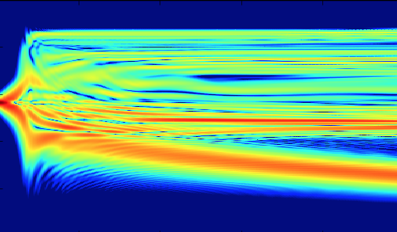

本文是[2019年同名博文]()的更新版本。就像在那里说的，光学计算是一个非常宽泛的话题，把所有的库放在一起，倒是具有一种<ruby>全栈<rp>(</rp><rt>full-stack</rt><rp>)</rp></ruby>工程师的气质，可是好像很容易造成*Stack Overflow*。

这次，我尝试对这些代码进行简单的分类。因为我不属于*光学前端工程师*[^no]，也不属于*光学后端工程师*[^no]，而更像是*光学系统运维*[^no]，分类得大概并不算准确。

## 物理光学演示：LightPipes

{{%figure src="lightpipes.png" width="50%"%}}
正像我之前说的那样，我使用[opticspy/lightpipes](https://github.com/opticspy/lightpipes)完成了一部分激光物理过程的模拟，这个库大体上能够满足我当时的要求。但是要注意的是，个人感觉这个库是为了物理实验、教学演示而设计的，揭示原理的部分多于实际计算的部分，而且计算是序列化的。或许把它理解成类似[虚拟物理实验室](https://phet.colorado.edu/zh_CN/simulations/filter?subjects=physics&type=html)更好？

不过如果能力足够的话，大概能在上面实现一些比较复杂的功能。~~而且话又说回来，真正有一些严肃需求的人，早就去求助一些商业软件了。~~

## 光线追迹（Ray Tracing）

在上次的博文里，在光线追迹方面，我曾经介绍过[Sterncat/opticspy](https://github.com/Sterncat/opticspy)，[RayOpt](https://github.com/quartiq/rayopt)和[cihologramas/pyoptools](https://github.com/cihologramas/pyoptools)，其中，前两组大概已经停止更新了，反而[pyoptools](https://github.com/cihologramas/pyoptools)看起来处于活跃开发的阶段。另外，这次我还看到了三个新鲜面孔：[mjhoptics/ray-optics](https://github.com/mjhoptics/ray-optics)、[mess42/pyrate](https://salsa.debian.org/mess42/pyrate/)和[bryancole/raypier_optics](https://github.com/bryancole/raypier_optics)[^name]。

### ray-optics

{}
*序列化*的光线追迹，或成像光学，完成度很高，甚至自带一个类似Zemax的界面。在其[手册](https://ray-optics.readthedocs.io/en/latest/Introduction.html)上提到：

> Rethink how image forming optical calculations are done absent historical constraints on computer speed and memory.

我学不会光学设计肯定是因为软件历史包袱太重，嗯。

### Raypier

非序列的光学追迹，在几何光学传输的基础上增加了一部分高斯光束和衍射效应，并且可以（通过VTK）生成一些漂亮的三维模型。（之后我一定要想办法成功安装……）

[文档](https://raypier-optics.readthedocs.io/en/latest/)在这里。

### pyrate

{}

正在写这篇博文的时候，我发现了这一套[代码](https://salsa.debian.org/mess42/pyrate/)，似乎可以与FreeCAD互动，但是更具体的功能和特性还没有仔细看。毕竟我还没找到文档在哪里……

### pyoptools

大概还在紧张地开发之中，等[文档](https://pyoptools.readthedocs.io/en/latest/raytrace.html)写好之后我会再回来看看的。

### 另：[ricktu288/ray-optics](https://github.com/ricktu288/ray-optics)

当然不是用Python编写的，但是谁不喜欢[开箱即用](https://ricktu288.github.io/ray-optics/)的玩具呢？

### 另：[Beam4](https://www.stellarsoftware.com/)及其他

也许代码就像蘑菇一样，找到一个又有另外两个出来。Beam4是用Java编写的，但看起来成熟度比这里的很多库高得多，比如将要提到的两个。

我把[tracepy](https://github.com/GNiendorf/tracepy)、[odak](https://github.com/kunguz/odak)和[optcom](https://github.com/optcom-org/optcom)列在这里，只是为了之后不要重新发现它们了。求求你们好好写写文档吧……

## 光学设计：为望远镜/日冕仪准备的Python

你想学习怎样设计日冕仪吗？ 

{}

就像所有的专业软件一样，如果你理解了整个物理过程，中间的示意图就并不是那么重要了。这样的库包括：

1. [brandondube/prysm](https://github.com/brandondube/prysm) ([examples](https://prysm.readthedocs.io/en/stable/examples/index.html))
2. [spacetelescope/poppy](https://github.com/spacetelescope/poppy)
3. [ajeldorado/falco-python](https://github.com/ajeldorado/falco-python)[^FALCO]
4. [ehpor/hcipy](https://github.com/ehpor/hcipy) ([examples](https://docs.hcipy.org/dev/tutorials/index.html))

等。

它们大概都能够计算光学系统的点扩散函数（PSF）、调制传递函数（MTF）、点列图之类的，而优化算法似乎欠奉[^algo]。如果你对上面的一系列名词不大了解的话，建议和我一起补习[《光学系统设计》](http://www.optzmx.com/forum.php?mod=viewthread&tid=1131&highlight=%B9%E2%D1%A7%CF%B5%CD%B3)。

{{% figure src="know-everything.jpg" alt="我逐渐理解一切" width="30%"%}}

这些库的对比可以看[这里](https://arxiv.org/abs/1807.07042)。[^OOC]如果你真的想设计日冕仪的话也可以读一读这篇文献，那里对设计方法也有一些介绍。

就我而言，我比较喜欢`HCIPy`，至少这里面还包含一些传递过程的内容，不至于直接跳到结论，和上个部分的库们更加接近一些。

## 另一类光线追迹

这种的主要目的是为了让自己的文章显得更好看，所以我就直接放两张图：

{}

{}

- 三维：[Raysect](https://github.com/raysect/source)，或者也可以用Blender+[OptiCore](https://github.com/CodeFHD/OptiCore)+[LuxCore](https://github.com/LuxCoreRender/LuxCore)（[youtube](https://www.youtube.com/watch?v=3hln88ukiZI)）
- 二维：[inkscape-raytracing](https://github.com/damienBloch/inkscape-raytracing)

## 电磁场级别的仿真

无论是用EME法求解模式的[CAMFR](https://github.com/demisjohn/CAMFR)，还是用FDTD法计算电磁场的[meep](https://github.com/NanoComp/meep)，都远远超出了我的能力，请有识之士自行判断。

## 激光谐振腔的简单计算

[rezonator](www.rezonator.orion-project.org)、[simcav/simcav](https://github.com/simcav/simcav)等，或许过于简单了，可能LightPipes能做的事情还要更多一些。

## 大气光谱学

请移步[这里](https://github.com/erwanp/awesome-spectra#atmospheric-spectra)和[这里](https://www.researchgate.net/publication/333046820_Py4CAtS-PYthon_for_Computational_ATmospheric_Spectroscopy)。

## 其他

- [PyNLO](https://github.com/pyNLO/PyNLO)：与非线性光学有关，大概是`SNLO`的某种代替品。
- [Jomiri/pyfiberamp](https://github.com/Jomiri/pyfiberamp)：有关掺Er光纤激光器的计算。没有什么用处。
- [AOtools/soapy](https://github.com/AOtools/soapy)：用于自适应光学过程的模拟，另有一组[用于分析](https://github.com/AOtools/aotools)的库。
- [Finesse and PyKat](http://www.gwoptics.org/finesse/)：为了LIGO设计的语言，用于引力波探测器的光路设计。这次我依旧没有看懂。
- [OASYS](https://www.aps.anl.gov/Science/Scientific-Software/OASYS)：如果X射线也是光的话，那么[WOFRY](https://github.com/oasys-kit/wofry)也是光学计算。
- [laserbeamsize](https://github.com/scottprahl/laserbeamsize)：一个完善的激光光斑直径和$M^2$计算库。

总之祝大家好运吧。如果有条件的话，还是尽量使用商业软件。Seriously.

[^no]: 据我了解并不存在前两种职业。而运维在哪里都存在。
[^name]: 感觉这些既会光学又会Python的人，在起名字方面都没有什么创意。
[^OOC]: Ruane, G., “Review of high-contrast imaging systems for current and future ground- and space-based telescopes I: coronagraph design methods and optical performance metrics”, in <i>Space Telescopes and Instrumentation 2018: Optical, Infrared, and Millimeter Wave</i>, 2018, vol. 10698. doi:10.1117/12.2312948. 
[^FALCO]: A J Eldorado Riggs, Garreth Ruane, Erkin Sidick, Carl Coker, Brian D. Kern, Stuart B. Shaklan, "Fast linearized coronagraph optimizer (FALCO) I: a software toolbox for rapid coronagraphic design and wavefront correction," Proc. SPIE 10698, Space Telescopes and Instrumentation 2018: Optical, Infrared, and Millimeter Wave, 106982V (9 August 2018); https://doi.org/10.1117/12.2313812，[PDF文件](https://core.ac.uk/download/pdf/211386255.pdf)
[^algo]: 如果尝试优化的话，可以看看[doi:10.1016/j.ijleo.2018.10.073](https://www.sciencedirect.com/science/article/abs/pii/S0030402618315821)