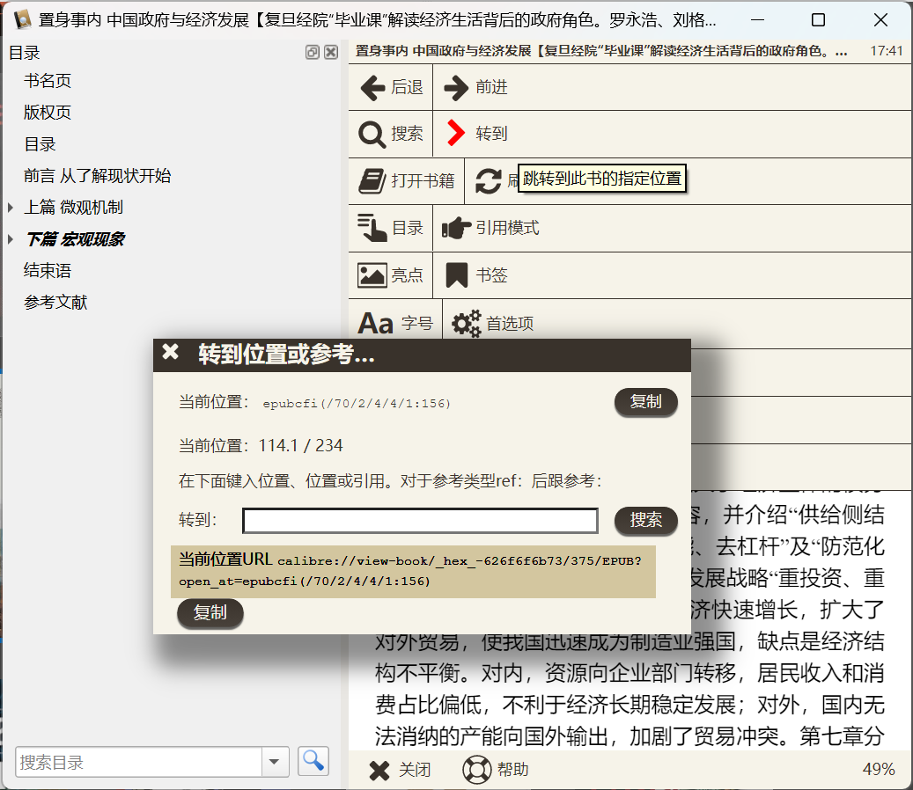

> 我被封在外面了。这种时候非常想念192.168.1.1……也非常适合写博客来回忆熟悉的网络。

无论是在家里的组装机还是漂泊的笔记本，在工作的时候都能够获得相似的上下文，有的时候甚至可以在家CTRL+C，在公司CTRL+V。除了*鸿蒙*系统之外，通过一组软件也是可以实现的。

本人现在所使用的方案如下。设置难度由易到难排序。

## 同步存储：Syncthing

> 前置条件：两台（或以上）容量较高的电子设备

比起云存储，个人更倾向于Syncthing这样的本地同步方案：至少文件是属于自己的（而且还不用收钱）。安装也很简单：Windows下安装[SyncTrayzor](https://github.com/canton7/SyncTrayzor)，Android下安装[Syncthing-Fork](https://github.com/Catfriend1/syncthing-android)，其他系统移步[这里](https://syncthing.net/downloads/)就可以。安装完以后，在两边选择工作目录，就可以完成双向同步了。得益于STUN服务器，无论是在内网还是外网，文件都可以完成传输。

当然，Syncthing也有一定的问题。首先是，因为是进行了同步，同一份文件会在每一个设备上都占用一份空间。在手机这样捉襟见肘的环境下，建议采用“仅发送”模式，只用来备份照片之类的。

另外，Syncthing在运行的时候必须要两侧的设备保持开机，电费账单+1。在有一方离线的时候，需要注意文件的版本，不要在两边都修改同一个文件。毕竟不是git，合并功能没有那么强。

## 笔记软件与文献管理

> 前置条件：同步的话需要Syncthing，或者云存储。

本人使用[Joplin](https://joplinapp.org/)和[Zotero](https://www.zotero.org/)来做笔记和进行文献管理，这两款软件都可以使用Syncthing作为同步后端[^how]，而且都具有笔记功能。我的习惯是，在Joplin上写一些需要较长篇幅的笔记，文献阅读笔记放在Zotero中。

[^how]:Joplin使用`File System`作为同步目标，Zotero使用[Zotfile](http://zotfile.com/)插件。就我自己而言，Joplin用了OneDrive，在手机上同步比起SyncThing更方便一些；Zotero那边，我自建了WebDAV服务，这纯粹是因为那时候我还没找到插件。

当然，作为一篇讲“互联”的博文，这两款软件当然也是可以相互连接的。我主要用到下面这些：

### Joplin内部

当然Joplin不是为了双链笔记而设计的，但是通过插件[plugin-note-link-system](https://github.com/ylc395/joplin-plugin-note-link-system)也可以获得一部分双链笔记的功能，比如说，方便地在一篇笔记里引用另外一篇笔记的某个小标题；或者是在另一篇笔记里看到backlinks。

### 笔记引用Zotero参考文献

通过[Better BibTeX for Zotero](https://retorque.re/zotero-better-bibtex/)的`Quick Copy`功能，按下`Ctrl+Shift+C`，就可以把当前文献复制成类似`[xxx](zotero://select/library/items/AAAAAA)`的链接。这种方式对别的笔记软件也适用，只要它能够打开`URL Scheme`。

如果把链接改写为`zotero://open-pdf/library/items/AAAAAA?page=114`，可以直接打开文件的第114页。


另外，Calibre也有类似的链接功能。我一般用Calibre来管理那些杂书。



### 引用计算机上的其他内容

肯定没有人想把所有文件都塞进笔记本的数据库里，总是要引用一些外部文件的，这时候还是需要用万能的链接。这里的链接格式类似`[xxx](file://C:\工作\xxx.docx)`，在Windows系统下既有斜杠也有反斜杠，但是很神奇地能够正确找到。

实际上还有一个问题，通过Syncthing同步后，文件在每台电脑上的链接地址是不一样的。所以，我在每台电脑的C盘做了一个文件夹链接[^j]。在Powershell下：

[^j]: 其实是[Junction](https://schinagl.priv.at/nt/hardlinkshellext/hardlinkshellext.html#junctions)，对于应用来说完全透明，两边的文件是完全一样的。

```powershell
New-Item -ItemType Junction -Path "C:\工作" -Target "C:\实际的\工作\目录"
```

或者也可以用[Link Shell Extension](https://schinagl.priv.at/nt/hardlinkshellext/hardlinkshellext.html)来做这件事。之后，在每台电脑上都可以访问`C:\工作\xxx.docx`了。

## 随处Ctrl+V，以及传文件

> 是这样的张总：你在家里的电脑上按了CTRL+C,然后在公司的电脑上再按CTRL+V是肯定不行的。即使同一篇文章也不行。不不，多贵的电脑都不行。

> 前置条件：需要在同一个局域网下面——所以确实不行。

隆重推荐[KDE connect](https://binary-factory.kde.org/job/kdeconnect-kde_Release_win64/)，虽然是KDE出品，但是Windows和Android也能用。给手机和电脑装上这个，在同一个局域网下面就可以共享剪贴板了，而且还能够互相传文件。

不过，有的时候KDE connect找不到局域网设备，这时候我会用Total Commander (Android)的Wifi传输插件，或者是`python -m http.server`。

## 远程访问：Tailscale、Tinc或Wireguard

> 前置条件：家里24小时开机的矿渣/跳板机/树莓派/NAS；有公网IP的VPS

像[之前]({})所说的那样，当前，如果我想要在外面访问家里的局域网，我会使用Tinc来建立隧道。运气好（外面有IPv6地址，大多是手机分享Wifi）的时候，可以直接连到自己的、IPv6地址与某个域名绑定的“跳板机”（ARM矿渣）上；运气不好的话，会自动有一台国外VPS进行转发，速度大概在~100K/s。如果用Wireguard的话性能会更好，可是我一直没有找到像Tinc一样简单的节点转发方案。

> 来自2023年的更新：现在我用回[Wireguard]()了~

连接Tinc之后，就可以通过`Wake On LAN`唤醒自己的其他电脑，然后用`samba`、远程桌面之类的软件了。就好象回到家里~~居家办公~~一样！

当然，在这种需求下，最简单的应该是`Tailscale`，但是由于迫害妄想，我一直没有尝试，而是另外找了类似的东西：

{}
- https://github.com/slackhq/nebula
	- ~~无法通过公共节点转发~~现在可以了
	- 两个Android客户端在移动网络、甚至是同一个无线网络都无法连接，离谱
- https://github.com/tonarino/innernet
	- 只实现了STUN，没有实现TURN
	- 也无法通过公共节点转发
	- 无Android支持
- https://github.com/juanfont/headscale
	- ~~无Android支持~~
- https://github.com/gravitl/netmaker/
	- 构建需要docker和干净的服务器
- https://github.com/netbirdio/netbird
	- ~~无Android支持~~
	- Wireguard客户端无法使用
- [vpncloud](https://github.com/dswd/vpncloud)
	- 只支持Linux
{}

好了，这次我想说的就是这些。办公室冰冷的行军床正在等着我。