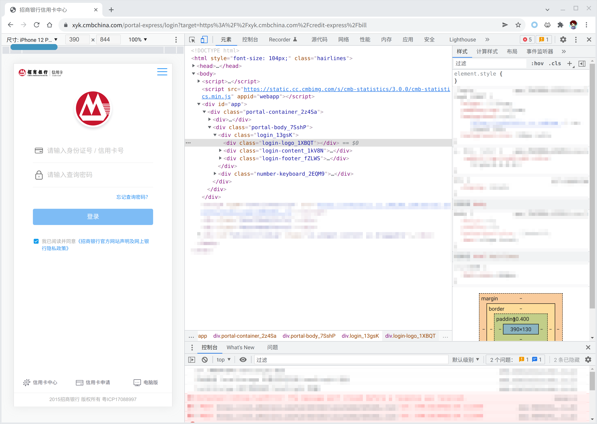
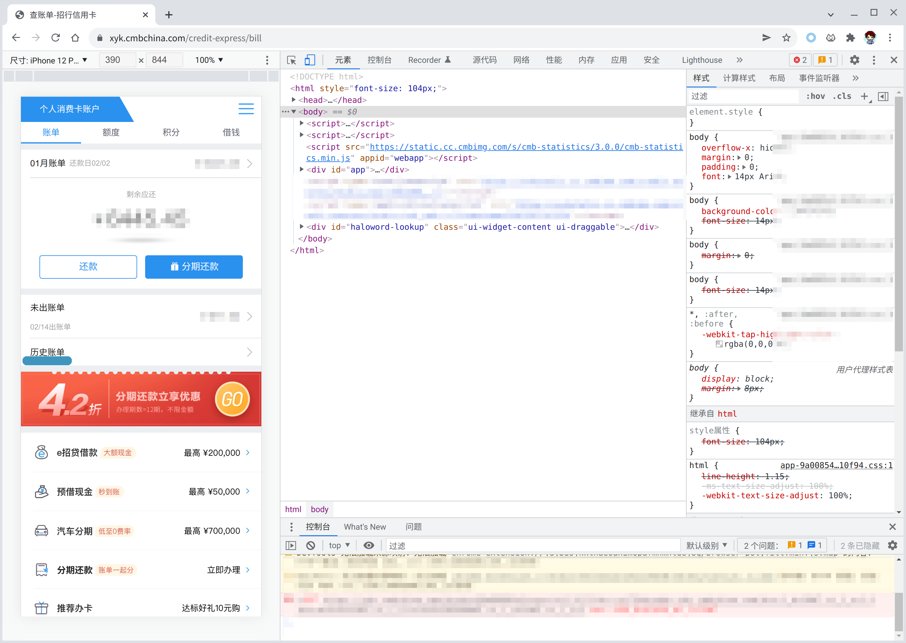
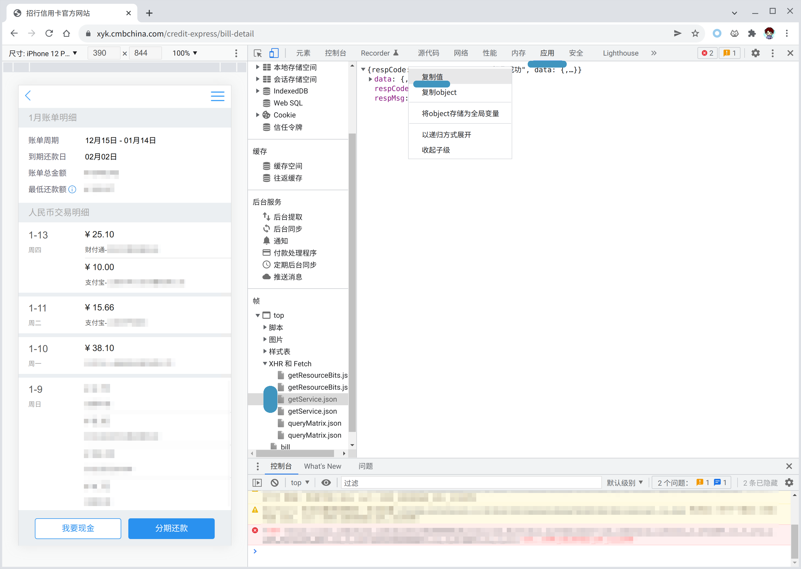

<figure>
<audio controls preload="metadata">
<source src="th08_06.mp3" type="audio/mpeg">
</audio>
<figcaption><h4>BGM: 懐かしき東方の血　～ Old World</h4></figcaption>
</figure>

> 按：
> 
> 最近招商银行不再给我发送EML格式的电子邮件账单了，取而代之的是邮件中的PDF附件，*仅供人类阅读*，基本上没有办法进行自动处理。于是我故伎重施，试图在IE驱动的网上银行中找到账单，可是找到的却只是用Electron包裹的丑陋电子银行客户端，理所应当地不提供下载服务。
>
> 紧紧关闭的大门前，仅有一点点光芒透出来：招行的手机版网站仍然可用。

- 招商银行信用卡官方网站在<https://xyk.cmbchina.com/credit-express/bill>。为了假装自己是在用手机访问，请使用Chrome浏览器[^1]，开启开发者工具，显示设备工具栏（Ctrl+Shift+M），并模拟iPhone或者其他手机。

- 如果能够顺利登录的话，大概能够看见自己的欠款金额了。这个网站采用React+Mobx开发，与后端通过`fetch`通信，可能也有某种加密。只是下载网站上的数据的话，也许不能算犯`破坏计算机信息系统罪`。

- 点击“历史账单”；
- 点击开发者工具中的“应用”tab；
- 点击`帧`-`XHR和fetch`-`getService.json`；
- 右击右侧的`respCode`，选择复制值；

- 粘贴到一个`cmb.json`内。

好的，我们已经获得了本月账单的JSON文件了。

{}
```json
{
    "respCode": "1000",
    "respMsg": "操作成功",
    "data": {
        "rmbBillInfo": {
            "amount": "9999.90",
            "billCycleStart": "20211215",
            "billCycleEnd": "20220114",
            "repaymentDate": "20220202",
            "minPayment": "999.90"
        },
        "dollarBillInfo": {
            "amount": "0.00",
            "billCycleStart": "20211215",
            "billCycleEnd": "20220114",
            "repaymentDate": "20220202",
            "minPayment": "0.00"
        },
        "detail": [
            {
                "billId": "0",
                "billType": "DetailBill",
                "billDate": "20220113180009",
                "billMonth": "202201",
                "org": "999",
                "transactionAmount": "88.88",
                "amount": "88.88", //实际的RMB入账
                "description": "财付通",
                "postingDate": "20220114",
                "location": "CN",
                "totalStages": "",
                "currentStages": "",
                "remainingStages": "",
                "transactionType": "消费",
                "cardNo": "6666"
            },]
    }
}
```
{}

接下来，可以使用你喜欢的方法对账单进行处理了。对于beancount，我写的importer放在[这里](https://github.com/heyeshuang/beancount-homemade-importers)。

[^1]:Firefox似乎对所谓的“安全”键盘存在一些兼容性问题。