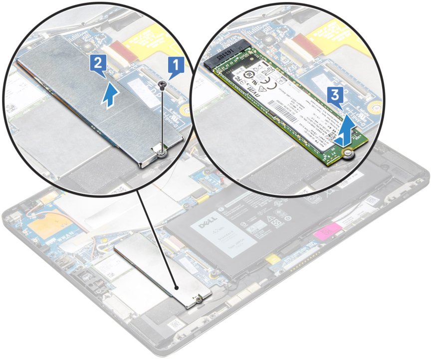

在过年期间，我突然想买一个大一些的平板。（PDF看不下去一定是因为小米平板4尺寸太小！）

刚好赶上网课热潮，最近安卓系统的新平板还挺多的，比如小米平板5啊、小新pad啊、华为平板啊什么的，可是都有一些这样那样的问题[^p]。

那就去看看Windows系统的平板吧。（自从我的寨板坏掉以后已经过去好多年了，~~最近的技术一定进步了很多吧。~~）

然后我看到了2022年的上网本们，根据我五年之前的经验，那种东西大概率不是为Windows设计的。唯一看起来配置像是20年代的[寨板](https://item.jd.com/10043396524201.html#none)，又听说有[屏闪](https://www.notebookcheck.net/Alldocube-iWork-GT-i5.594533.0.html)的问题。

再然后，找来找去，发现淘宝上居然有自称“官翻”的戴尔平板卖，2018年的I5-8250U大概也许会和2022年的I3-1115G3[差不多](https://cpu.userbenchmark.com/Compare/Intel-Core-i5-8350U-vs-Intel-Core-i3-1115G4/m388461vsm1333512)？

时间回到今天，我收到这台[Latitude 5290](https://www.dell.com/en-my/shop/cty/pdp/spd/latitude-12-5290-2-in-1-laptop)刚满一个月，而且还没有爆炸，我感到十分欣慰：



- 屏幕上有几道小划痕，没有贴膜留下的气泡明显；
- 电池健康度95%（自称），SSD通电9天（自称），板载内存是8G的LPDDR3，`又不是不能用.jpg`
- 重达899g，阅读？没有锻炼身体重要！
- ~~据说~~比surface好拆，~~我还没试，主要是还没有蹲到便宜的SSD~~ M.2 2280的铠侠RD20效果良好；

- 第八代Intel是官方支持Windows11的[最老版本](https://docs.microsoft.com/en-us/windows-hardware/design/minimum/supported/windows-11-supported-intel-processors)，目前还没有遇到什么问题，Android模拟器也能用；
- `scoop`处理文件关联太头疼了，而且`winget`已经可以识别系统代理了，还是用`winget`吧，另外，`Windows Terminal`也不错。
  
啊，扯远了。大概现在就想到这些，再想起别的什么，或者平板真的爆炸了的话，我会再来更新的。

[^p]:小米平板5没有USB3.0；联想小新系列国外版型号挺混乱的，估计不会有lineageOS支持了；华为……沸腾了，有点过热。
