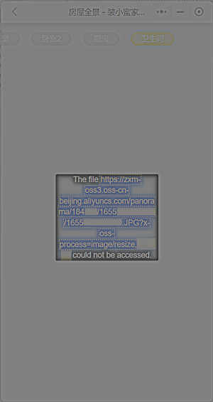

> 最近，我家的装修终于告一段落，历时6个月，经验大概可以水三四篇博文——如果博主的拖延症能治好的话。今天先从最简单的部分开始。

装小蜜是北京地区比较流行的监理服务，价格比起正规监理（有监理证的那种）要便宜许多，在装修过程中应该也是有作用的。每次上门服务时，监理会在每个房间拍一张全景照片，如果工长不提供水电位置图的话，之后这些照片应该能派上用场。

像所有Web2.0之后的公司一样，这家公司主要在APP和微信小程序上提供服务，而且并不具备数据导出功能。这种情况的一般解决方案是抓包，只要配置好xposed、HTTPCanary，解决TLS证书固定之类的问题就行了，我一开始就是这么做的，之后发现了别的方法：只要屏蔽一个特定域名（zxm-oss3.oss-cn-beijing.aliyuncs.com），微信小程序上就会显示图片的实际位置。



具体上，按照这里[^1]的思路，我也使用Clash For Windows，把所有来自阿里云的请求屏蔽掉。然后在微信电脑版上打开小程序，就可以得到上图。之后，直接用鼠标把链接拖动到TXT里面，就可以用你最喜欢的工具下载了。

```yaml
proxies:
  - name: Fiddler
    type: http
    server: 127.0.0.1
    port: 8888
proxy-groups:
  - name: Proxy
    proxies:
      - Fiddler
    type: select
rules:
  - DOMAIN-KEYWORD,aliyuncs.com,REJECT
  - PROCESS-NAME,Fiddler.exe,DIRECT
  - MATCH,DIRECT
```

另外，小程序是用[Pannellum](https://pannellum.org/documentation/overview/)进行渲染的。下载到的照片可以用[这个网站](https://renderstuff.com/tools/360-panorama-web-viewer/)查看。好像和直接用小程序没有什么区别……

## 附：微信小程序缓存位置

> C:\Users\me\AppData\Roaming\Tencent\WeChat\radium\web

我是用[Process Monitor](https://learn.microsoft.com/en-us/sysinternals/downloads/procmon)监测文件变化发现这个路径的。

[^1]:[Windows 微信小程序无法抓包解决办法 - 知乎](https://zhuanlan.zhihu.com/p/564786074)