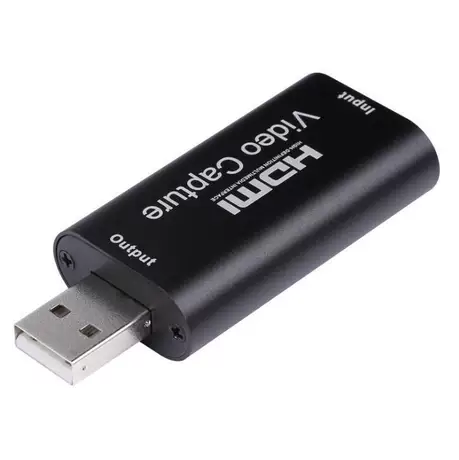

> 说起DIY的IP-KVM，当然是[PiKVM](https://github.com/pikvm/pikvm)以及一系列衍生项目，可是对于~~那些把钱投入庞氏骗局的~~穷人来说，RPI4已经远不能称为*inexpensive*。近几天，我从垃圾堆里翻出了**同样**昂贵的Phicomm N1和一张30块的视频采集卡，发现正好也能用。



把远程控制取名叫作IP-KVM，这对于SEO来说过于不友好了。每当搜索Google的时候，总会看到有人试图在N1上跑虚拟化（aka KVM），可能是对2G内存有些什么不切实际的幻想。最后，在GitHub上找到了在N1上安装PiKVM的脚本：[toss-a/pikvm-armbian](https://github.com/toss-a/pikvm-armbian)。不过这里的[说明](https://github.com/toss-a/pikvm-armbian/blob/master/README-zh-CN.MD)也稍微有些简略，我会努力稍微详细一点点，尽量。

那么，需要准备下面这些东西：

1. N1一台；
   > 我的N1是从垃圾堆里捡回来的，如果是新购的话，应该会有一些更新、[更好的选择](https://github.com/toss-a/pikvm-armbian/blob/master/README-zh-CN.MD#1%E9%80%89%E6%8B%A9%E5%8E%9F%E7%94%9F%E5%B8%A6%E6%9C%89otg%E7%9A%84%E5%BC%80%E5%8F%91%E7%89%88-%E4%BE%8B%E5%A6%82)。注意，这些选择需要能够OTG。
2. USB公对公数据线一条；
   > 因为N1的USB口有OTG功能，直接连接被控电脑就可以模拟鼠标和键盘。
3. 视频采集卡一张，配HDMI线一条；
   > 因为N1没有USB3.0接口，MS2109芯片就足够了，可以跑1080p@30Hz。

3. U盘一块；
4. Linux知识一些；
1. 可能会需要：
   1. USB键盘一个；
   2. USB延长线一条；
   3. 理想的上网环境。
      > 根据相关法律法规和政策（下略）

不需要准备Arduino、BadUSB、USB Rubber Ducky，或者其他的单片机，虽然我的垃圾堆里也有不少。


 
## 安装系统：Armbian（Ubuntu口味的）

这部分已经有很多人写过了，大概步骤是降级—BalenaEcther镜像写入U盘—Armbian写入EMMC。可以参考[GitHub说明](https://github.com/ophub/amlogic-s9xxx-armbian/blob/main/README.cn.md#%E5%AE%89%E8%A3%85-armbian-%E5%88%B0-emmc)、[其他人的博客](https://ethanblog.com/tips/play-with-n1-box.html)或者[B站](https://www.bilibili.com/video/BV1QJ411k7AH/)。要注意，在盒子的原始系统尚未关机时不要插入U盘，Android系统会破坏U盘文件的权限。

Armbian镜像我使用的是[Armbian\_23.05.0\_amlogic\_s905d\_jammy\_6.1.27\_server\_2023.05.13.img.gz](https://github.com/ophub/amlogic-s9xxx-armbian/releases/download/Armbian_jammy_lts_2023.05/Armbian_23.05.0_amlogic_s905d_jammy_6.1.27_server_2023.05.13.img.gz)，其中，`S905d`是N1所用的芯片，`Jammy`是Ubuntu的版本号，`6.1.27`代表使用的是最新版本的Linux内核。如果安装PiKVM，Debian系列（bullseye）的软件包有些太老了。

## 修改dtb文件

> 好，到这里时，我会假设：N1已经刷成了Ubuntu风味的Armbian系统；连接好网络，有线无线都可以；能够输入命令——不管是直接插键盘显示器，或是通过SSH，还是直接从电路板上引出导线。

在上述的Armbian引导文件中，默认的USB模式是Host，为了模拟鼠标、键盘等设备，需要将`dr_mode`从`host`更改为`peripheral`[^1]。那么，我们需要重新编译dtb文件：

```shell
# 将dtb编译为dts文件
dtc -I dtb -O dts -o test.dts /boot/dtb/amlogic/meson-gxl-s905d-phicomm-n1.dtb
# 用你喜欢的编辑器打开这个文件
vim test.dts
```
在`test.dts`中搜索`dr_mode`，寻找首个`dr_mode = "host";`，改为`dr_mode = "peripheral";`。
这里的上下文大概是这样：

后面的`dr_mode`不必修改。不要问我为什么，这部分超出了我的能力。之后重新把dts编译回去，移动到`/boot/dtb/amlogic/`，并且修改启动项：

```shell
dtc -I dts -O dtb -o n1-test.dtb test.dts
sudo mv n1-test.dtb /boot/dtb/amlogic/
sudo vim /boot/uEnv.txt
```
把`FDT`一行改为`FDT=/dtb/amlogic/n1-test.dtb`：


然后重启系统。

## 安装脚本

> 此时，假设你能够透明地访问github和其他网站，`curl google.com`返回`302`或者`200`。如果不行的话，可以尝试在N1上安装[zfl9/ss-tproxy](https://github.com/zfl9/ss-tproxy)，让N1同时承担旁路网关的功能。

```shell
git clone https://github.com/toss-a/pikvm-armbian.git
cd pikvm-armbian
./install.sh
```
在提示`"Do you want to apply custom patches?  [y/n] "`时，选择N。

接下来，重启系统，再次运行`install.sh`，然后关机。

## 连线和启动

N1靠近HDMI接口的USB口已经改为OTG从机模式，把双公头USB线插在这里，另一头插到被控计算机上。这时候，如果视频采集卡插不上的话，拿出提前准备好的延长线。下面的照片来自[这里](https://pockies.github.io/2019/03/07/phicomm-n1/)，照相技术牛逼疯了。


重新插入电源，用随便的浏览器访问N1的IP地址，并忽略证书错误提示。初始用户名和密码都是`admin`，别忘了修改登录密码，用`sudo kvmd-htpasswd set admin`。

另外，感谢[pikvm](https://github.com/pikvm/pikvm)项目，有钱的话就去支持[他们的硬件](https://pikvm.org/)吧！

[^1]:Ref：[README](https://github.com/toss-a/pikvm-armbian/blob/master/README-zh-CN.MD#%E7%AC%AC%E4%BA%8C%E6%AD%A5)，这个写的其实挺清楚的，比我的好。