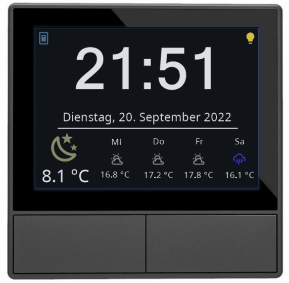
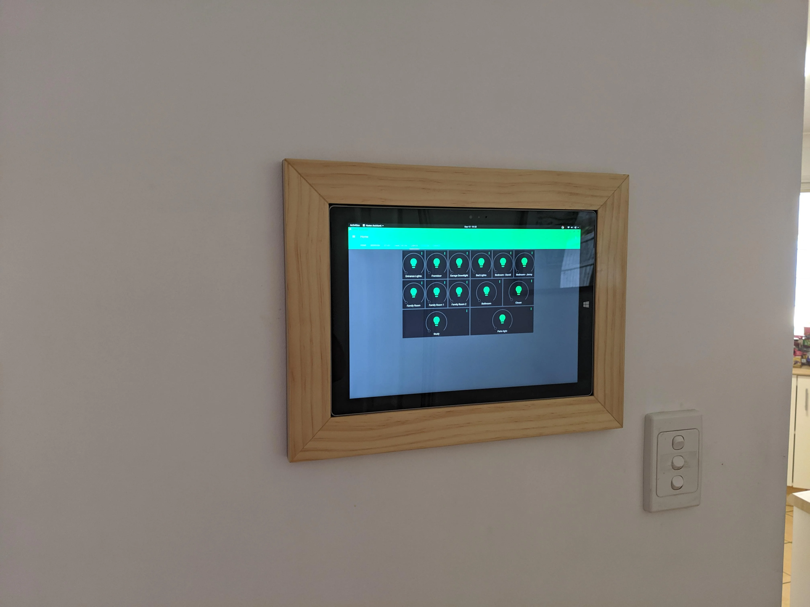

> 而RK3328的算力与草履虫大约能打成平手。所以，本文中的“智能”指的都是 *不用按电钮就能控制™* 级别，当然，如果能够有一点点自动就更好了。

## 前期的准备

### 考虑一下

其实当个mi boy也不错——全屋小米设备是智能家居方案里面最不坏的选择，做完就可以成为合格的家居up主了[^1]。不过，如果不想被锁定在米系势力范围内，可以尝试一下Home Assistant，尝试成本也不高：几十块钱的魔百盒或者玩客云，或者直接虚拟机都可以。另外，最好能有一个简单的设备来控制，我觉得带红外遥控的小爱音箱 Pro就挺好的。

### 装修时

当然是老生常谈的那些：在开关里面留零线、不要做双控（贵）、多做网线口、窗帘盒旁边做插座之类的，剩下的事情只能等到装完以后再后悔了。

就我来说，我比较后悔没有给拖地机器人留上下水的位置，没有把净水器的纯水管引到客厅，也没有留两个给摄像头和人体存在传感器的插座。

## 新手的采购清单

最好能够遵循 *Graceful degradation* 原则：保证有东西坏掉的时候至少还是个mi boy，然后就可以把所有问题推到米家服务器身上了。另一方面，如果要在熟练后彻底摆脱米家的控制，需要寻找那些离线仍然可以通过HA控制的设备，也就是说，最好不要选择米家~~臭名昭著的~~最新的BLE Mesh系列。那么，在2022年，我的选择是大量的Zigbee设备、少量的Wifi设备和更少的蓝牙设备。Nothing Matter.

{}
| 设备                  |数量 |
|-------------------------|----|
| 墙壁开关E1（零火双键）  | 10 |
| Aqara双色温LED灯泡T1    | 6  |
| Aqara智能墙壁插座Zigbee | 1  |
| Aqara水浸传感器         | 2  |
| Aqara人体传感器         | 2  |
| Aqara门窗传感器         | 1  |
| Aqara温湿度传感器       | 1  |
| yeelight m3筒灯（BLE） | 1  |
| 米家第三方壁灯（BLE）    | 2  |
| 米家客厅吸顶灯          | 1  |
| 米家卧室吸顶灯450       | 1  |
| 米家卧室吸顶灯350       | 2  |
| 杜亚M2米家款电机（Aqara的买不起）| 3  |
| 门锁1s（BLE）          | 1  |
| 小米多模网关            | 1  |
{}

Aqara在闲鱼买会显得不那么冤大头，杜亚牌电机也比杜亚代工的Aqara电机便宜很多。家电方面，美的和其副牌（小天鹅、华凌、colmo之类）一般自带网络功能，通过插件[midea_ac_lan](https://github.com/georgezhao2010/midea_ac_lan)和HA配合的很不错。



对了，还需要一台能够24小时开机的设备，比如NAS啊、矿渣啊什么的。

## 安装和设置

安装HA的部分在此不再赘述。通过米家APP配置以上的所有设备，并使用[hass-xiaomi-miot](https://github.com/al-one/hass-xiaomi-miot)和[XiaomiGateway3](https://github.com/AlexxIT/XiaomiGateway3#supported-firmwares)导入HA。这里需要注意的是，`hass-xiaomi-miot`集成只能对WiFi设备进行本地控制，对Zigbee和BLE设备[需要通过米家服务器](https://github.com/al-one/hass-xiaomi-miot/issues/100#issuecomment-855183156)。所以最好由`gateway3`控制这些设备，在`hass-xiaomi-miot`集成中禁用。

考虑到安装非智能灯的可能性，我采用了`智能开关+智能灯`的组合，这种组合更为保守，`凌动开关+支持凌动的智能灯`效果大概会更好。在把所有智能灯配置完成后，在米家APP上把链接智能灯的开关`转为无线开关`，然后在HA中设置自动化，感觉比米家自动化的反应更灵敏一些。不过，为了防止在HA断掉时挨骂，我也在米家APP上添加了备份：在同时按下开关左右键的时候关闭智能灯。



这样，在关闭智能灯的时候不会断电，可以实现灯光缓灭、[自适应照明](https://github.com/basnijholt/adaptive-lighting)等高级功能。

窗帘的部分就更简单了，只要定时开关就行。通过HA的手机APP，可以将[下一个闹钟时间](https://companion.home-assistant.io/docs/core/sensors/#next-alarm-sensor)导入自动化，实现闹铃响起时打开窗帘。

## 附加题部分

在基本框架（aka灯和窗帘）搭好之后，就可以放飞自我搞一些新花样，这里举两个例子。

### 智能面板

[Sonoff NSPanel](https://detail.1688.com/offer/662976153559.html?spm=a26352.13672862.offerlist.49.3a512910uzdgfQ)应该是最便宜的智能面板了，而且可以刷第三方固件[lovelace-ui](https://github.com/joBr99/nspanel-lovelace-ui)或[NSPanel_HA_Blueprint](https://github.com/Blackymas/NSPanel_HA_Blueprint)，可玩性非常高。

如果需要更大的屏幕，甚至可以在仓库里找一些淘汰的设备，比如说还能亮的山寨平板、二手安卓手机、闲鱼低价带屏开发板之类。通过[WallPanel](https://wallpanel.xyz/)和[HA的kiosk-mode插件](https://github.com/NemesisRE/kiosk-mode)，可以让这些设备直接成为HA的前端显示[^web]。



作为一个直男，还有一件事情要嘱咐：不要搞得太丑了，正常人不会喜欢满墙飞线的，至少拿个相框遮一下。这部分我也不会，所以我从网上找了一张图。

### ESPHome

传感器是从遥控家居走向智能的关键一步，在需要更多种类的传感器时，[ESPHome](https://esphome.io/)能够派上用场。只需要一块ESP32，加上AHT20就是温湿度计，~~加上SGP30是TVOC检测仪~~[^2]，加上PZEM-004T就是智能电流表，加上LD2410就是人体感应雷达，而且都可以与HA控制的所有设备联动。唯一的问题是，ESP32系列一般是通过Wifi联网，可能会对路由器造成一点点压力，如果是一万块钱的高级路由器K3就无所谓了。

另外，如果完全不想和小米打交道，易微联、涂鸦或小燕科技的设备也可以试试。没准过几~~天~~年Matter设备也会上市？

------

那么关于智能家居的第一部分在此告一段落，之后会记录一些[更为个性化的部分]()，而今天又是一个思念192.168.1.1的日子。虽然心已随着VPN回到家乡，但身体仍在公网上漂泊。

## 参考

- [HA智能硬件采购避坑指要](https://bbs.hassbian.com/thread-16261-1-1.html)
- [论如何打造一个科技爱好者/直男审美的家——（五）智能家居](https://post.m.smzdm.com/p/a85gplo7/?from=other&invite_code=zdm8xwesxhinv&send_by=6416413937&utm_source=pocket_mylist&zdm_ss=Android_6416413937_)
- [智能家居防悔全指南(小米/绿米)](https://zhuanlan.zhihu.com/p/87595668)

[^1]:那么你可以直接跳过这篇文章，不会有什么损失。
[^2]:这个不要用，长期开机读数会暴涨。
[^web]:HA前端对浏览器版本有一定要求。如果设备过于古老的话，可能需要手动更新Webview，见[此处](https://blakadder.com/android-panel-webview/)。