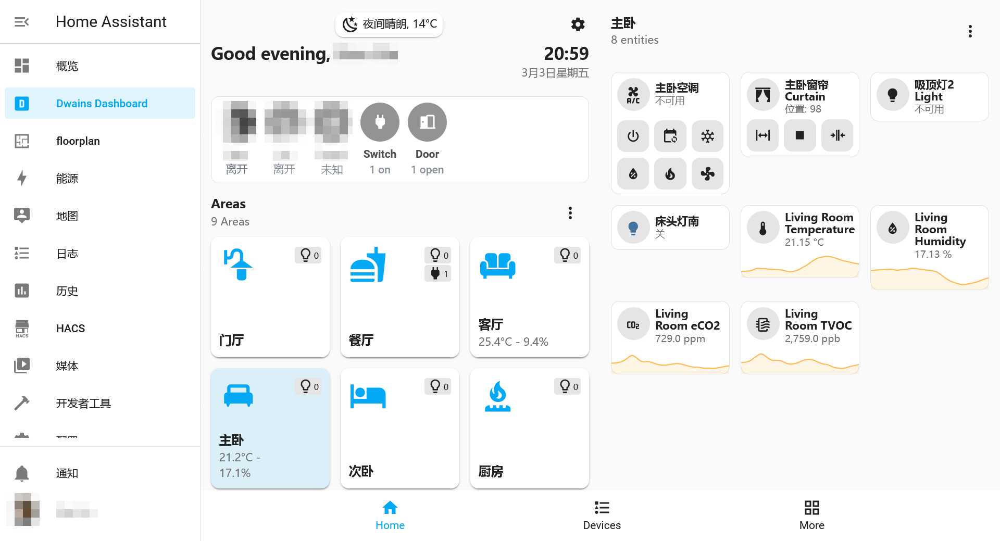
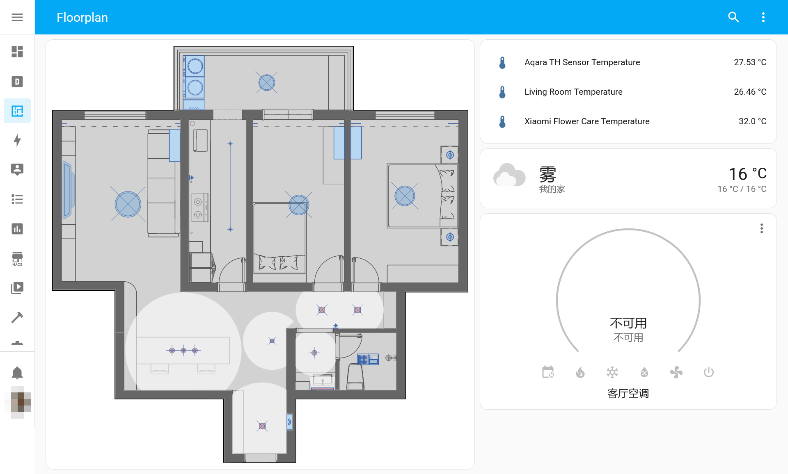
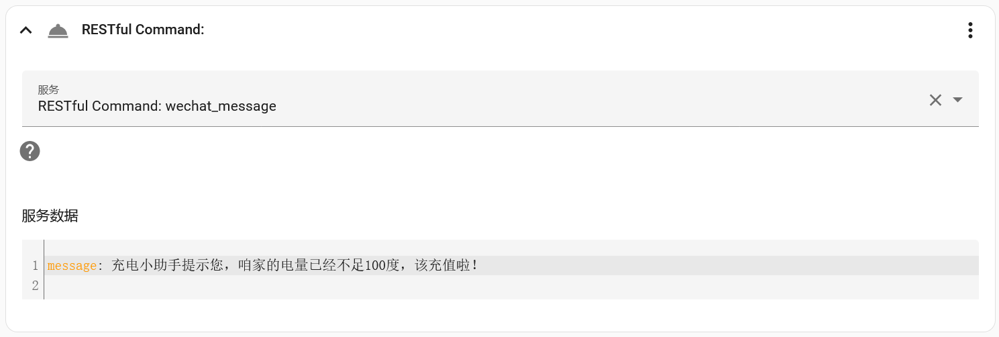
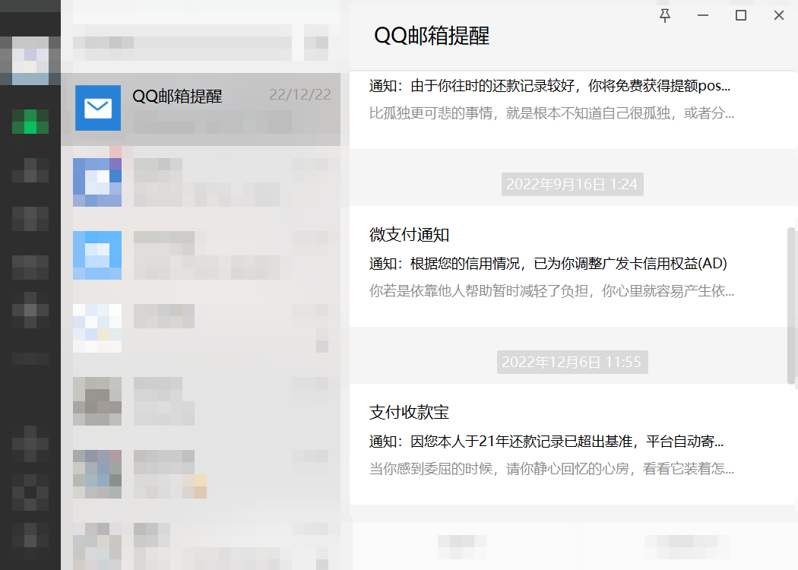

书接[上文]()。说起来，智能家居的可复制性在软件领域里是比较差的，在完成基础的环境搭建之后，功能需求要根据自己的实际情况来决定，以下的所有内容仅供抛砖引玉之用。


## 前端显示

隆重推荐[Dwains dashboard](https://github.com/dwainscheeren/dwains-lovelace-dashboard)，这是在HA生态系统下仅有的不怎么需要折腾的部分。只需要把每个设备的*区域*选好，就可以得到一组还不错的面板：



而[Floorplan](https://experiencelovelace.github.io/ha-floorplan/)是另一个极端，这个组件需要很久——非常久——才能够完成，而完成之后也只有无尽的空虚。为了缓解这空虚我也姑且把截图放在这里。



## 手机消息提醒

作为没有统一推送服务的安卓用户，加入新的后台程序无异于火上浇油，所以最经济的方法是投靠大流氓微信。之前互联网上常见的方法是[企业微信发送应用消息](https://www.jianshu.com/p/182ea14af3f2)，不过到了2023年，这种方式需要绑定固定IP和域名，所以我换成了[企业微信机器人](https://www.pushplus.plus/doc/extend/webhook.html#%E5%BC%95%E8%A8%80)。这种方法需要有一个微信群（两人以上），对单身贵族不是十分友好。

在获得Webhook地址之后，在HA配置文件中添加以下行：

```yaml
# configuration.yaml
rest_command:
  wechat_message:
      url: "https://qyapi.weixin.qq.com/cgi-bin/webhook/send?key=略"
      method: post
      content_type: 'application/json'
      payload: '{"msgtype":"text","text":{"content":"{{  message  }}"}}'
```

就可以在自动化中`Call a service`，调用`wechat_message`了。



另外，可以试试[showdoc推送服务](https://blog.star7th.com/2022/03/2421.html)。我没用过，不对这个负责。

或者直接想办法给微信绑定的QQ邮箱发信，反正他们信用卡诈骗邮件都是这么干的。



或者直接用Home Assistant自带的[HTML5 Push Notifications](https://www.home-assistant.io/integrations/html5)；或者TG机器人；或者自建[ntfy.sh](https://ntfy.sh/)——反正都很复杂。

## 开关其他计算机

当前，因为不想和国家电网签约，我在平时保持台式机和NAS处于关闭状态，只在需要时通过HA所在的矿渣来[Wake on LAN](https://www.home-assistant.io/integrations/wake_on_lan/)。

开机问题解决了，关闭需要另外的解决方式。对于Windows系统，可以使用[IOT Link](https://gitlab.com/iotlink/iotlink/-/wikis/Addons/Commands)；而对于更常用的Linux系统，可以使用SSH来运行shutdown。仍然是HA配置文件：

``` yaml
#configuration.yaml
switch:
  - platform: wake_on_lan
    name: Trashbin
    mac: 00:00:00:00:00:00
    host: 192.168.8.88 #用ping来检测是否已开机
    turn_off:
      service: shell_command.turn_off_trashbin
shell_command:
  turn_off_trashbin:  "ssh -i /config/ssh_keys/id_rsa_homeassistant -o 'StrictHostKeyChecking=no' user@192.168.8.88 'sudo /usr/bin/systemctl poweroff'"
```

别忘了把私钥放在`/config/ssh_keys/id_rsa_homeassistant`，并上传公钥。在`authorized_keys`中动些手脚，可以[限制SSH允许执行的命令](https://www.virtono.com/community/tutorial-how-to/restrict-executable-ssh-commands-with-authorized-keys/)。另外，需要设置sudo在运行poweroff时不需要密码。

```bash
## sudo visudo
%sudo   ALL=(ALL) NOPASSWD: /usr/bin/systemctl poweroff
```
## 远程访问

[之前这篇文章]()就是为了这个。
## 在家检测

又名device tracker，与路由器有关，我用了[OpenWrt (luci)](https://www.home-assistant.io/integrations/luci/)集成。独居的话，[BLE门锁](https://github.com/AlexxIT/XiaomiGateway3/wiki/Handle-BLE-Locks)也能完成类似的工作。控制欲更强的朋友可以尝试[ESPresense](https://github.com/ESPresense/ESPresense)，应该是能到房间级别。

## 零冷水

如果你像我家一样，燃气热水器/壁挂炉离浴室太远，需要一套零冷水系统，那么首先需要把回水管留好。然后……最好能搞点[成品系统](https://www.xiaomiyoupin.com/detail?gid=152447)，不要像我一样用[屏蔽泵](https://item.taobao.com/item.htm?spm=a1z09.2.0.0.ef352e8dz7aUZB)和智能开关解决，毕竟这玩意还是有一定难度的。


弄完之后，把水泵插在智能插座上，在卫生间安装人体传感器，每当卫生间有人经过的时候就运行半小时。

没有预留回水管的话可以参考[这里](https://post.smzdm.com/p/a9g2nm9o/)。

## 自适应照明

……[感觉很高级](https://post.smzdm.com/p/a8x5xqpl/)，没了。

## 监控摄像

为了照料人类幼崽，我买了3个摄像头，是广受好评的TP-link系列[^i]，ONVIF协议除了端口是`:2020`之外和标准一模一样，也自然支持HA的[ONVIF](https://www.home-assistant.io/integrations/onvif/)集成。

因为正好有一台杂牌NAS，硬盘录像机的钱可以省掉了。NVR软件方面，我尝试了`Shinobi.video`[^s]和`motioneye`[^m]，最后选了iSpy公司的[Agent DVR](https://www.ispyconnect.com/download.aspx)，设置最简单，也具有最完善的HA集成，抱歉啦开源社区。

## 附：当前用到的自动化

- 按下开关 -> 关掉对应的灯
  > 每个灯都要做一次，很无聊。但是设置完之后，每个灯都能缓缓熄灭，就……挺高级的。
- 开关窗帘
  - 在每天晚上8:00自动关闭所有窗帘
  - 我在家的情况下，当我的下一个闹钟响起时，打开主卧窗帘
  - 早上8:30打开所有窗帘
- 浴室门
  - 浴室门关闭 -> 打开照明、打开循环泵
  - 浴室门开启 -> 关闭照明、关闭浴霸制热、等待十分钟 -> 关闭浴霸通风 
- 防盗门
  - [门从外部被打开](https://github.com/AlexxIT/XiaomiGateway3/wiki/Handle-BLE-Locks) -> 打开门厅灯、打开循环水，如果在8:00-22:00间，小爱播报“欢迎回家”。
    > 就……挺高级的……吧……
- 循环泵
  - 每天午夜关闭循环泵
  - 开启30分钟后关闭循环泵
- 在电费余额不足时，向企业微信发送信息


暂时我还没搞懂`NodeRED`是干什么用的，看起来[pyscript](https://community.home-assistant.io/t/pyscript-new-integration-for-easy-and-powerful-python-scripting)还更有趣一些。


### 

[^i]:型号是TL-IPC44AW Pro，那个Pro让它多了5G wifi支持。
[^s]:不太支持H.265格式的录制，实时播放老有问题，而且没搞懂HA集成怎么用。
[^m]:这个我没仔细试，祝你成功！