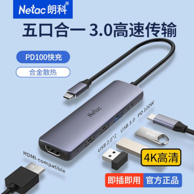
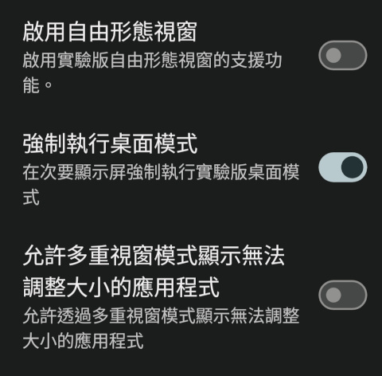
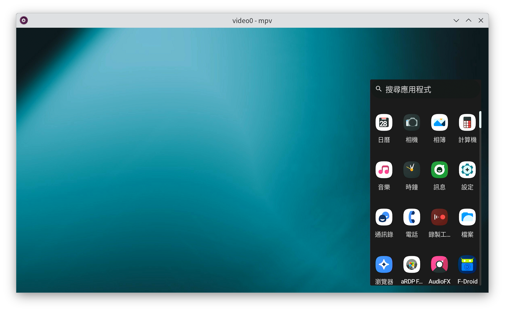

这样的话旧手机就可以作为瘦客户机用了，而且自带4G模块。

> 不要问为什么，工作造就人呀。

- 首先，为了连接显示器，旧手机的USB口需要支持DP-alt模式，至少USB2.0是没戏了。我用的是一加7T，并且血亏200大洋修好了虚焊。
- 然后，如果显示器没有type-c一线通，还需要搞一个扩展坞。

  - 这种（盛惠25元）有各种贴牌，在充电时USB口是用不了的。建议另找一套蓝牙鼠标。
- 把系统升级到Lineage OS 21，或者其他Android 14版本。每次更新，日志都说升级了桌面模式，每次都是一样的难用。
  - 如果是高贵的三星用户，就请当我没说过这句话。
  - 另外，别用Oxygen OS，桌面模式布局一团乱麻；也别用`Pixel Experience`，直接把手机干成`Qualcomm CrashDump MODE`，我还以为200块白修了。
- 插显示器的时候，不要用[SecondScreen](https://play.google.com/store/apps/details?id=com.farmerbb.secondscreen.free) APP，那个是给旧版本Android用的，挖孔屏使用的时候，显示器上会有黑边。
- 只需要在开发者选项里勾选“强制执行桌面模式”就可以了，其他的状态栏对我来说没有必要。

- 之后，连上显示器以后的Android桌面长这样。

- 关于RDP客户端，建议不要用[微软出品的APP](https://play.google.com/store/apps/details?id=com.microsoft.rdc.androidx)。据我测试，只有[Remote Desktop Manager](https://play.google.com/store/apps/details?id=com.devolutions.remotedesktopmanager)和[aRDP Free](https://play.google.com/store/apps/details?id=com.iiordanov.freeaRDP)支持鼠标中键。后面那个是[开源](https://github.com/iiordanov/remote-desktop-clients/)的。

- 按理说Moonlight也可以，不过还是RDP协议对4G友好点。
